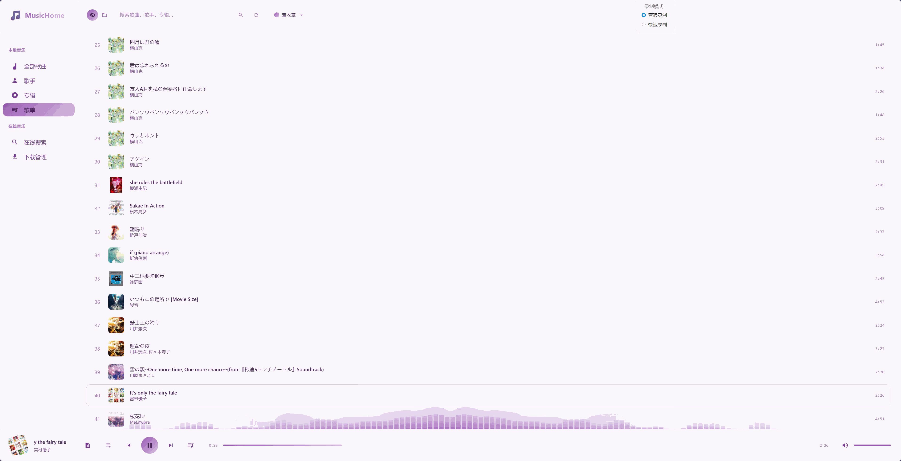

# MusicHome

本地音乐管理系统，在线音乐搜索 + 本地音乐扫描/播放，支持歌词同步、封面展示、多种播放模式。


## UI


## 技术栈

- **后端**: FastAPI + Uvicorn
- **数据库**: SQLite (aiosqlite + SQLAlchemy 2.0 async)
- **音频元数据**: mutagen
- **前端**: 原生 HTML/CSS/JS + Howler.js
- **风格**: 多种配色主题

## 功能特性

- 在线音乐搜索、试听、下载
- 本地音乐目录扫描，自动读取元数据和封面
- 歌词同步显示 (LRC)
- 播放模式：单曲循环 / 列表循环 / 随机播放
- 收藏歌曲
- 音频流式传输


## 项目结构

```
MusicHome/
├── app/
│   ├── main.py           # FastAPI 入口
│   ├── config.py         # 配置管理 (pydantic-settings)
│   ├── db.py             # 数据库初始化
│   ├── api/
│   │   ├── online.py     # /api/online/* 在线音乐
│   │   ├── local.py      # /api/local/*  本地音乐
│   │   └── stream.py     # /api/stream/* 音频流
│   ├── models/           # SQLAlchemy 模型
│   ├── schemas/          # Pydantic 请求/响应模型
│   └── services/
│       ├── scanner.py    # 本地目录扫描
│       ├── metadata.py   # 元数据读写
│       ├── downloader.py # 下载服务
│       └── scraper.py    # 在线数据抓取
├── static/
│   ├── index.html        # 主页面
│   ├── css/              # 样式文件
│   ├── js/               # 前端逻辑
│   └── img/              # 图片资源
├── data/                 # SQLite 数据库 (gitignored)
├── .env                  # 环境配置 (gitignored)
├── .env.example          # 配置模板
├── requirements.txt
└── run.py                # 启动入口
```

## 快速开始

### 1. 克隆项目

```bash
git clone https://github.com/Zweo/MusicHome.git
cd MusicHome
```

### 2. 创建虚拟环境 & 安装依赖

```bash
python -m venv .venv
# Windows
.venv\Scripts\activate
# Linux/macOS
source .venv/bin/activate

pip install -r requirements.txt
```

### 3. 配置环境变量

复制配置模板并编辑：

```bash
cp .env.example .env
```

编辑 `.env` 文件：

### 4. 启动服务

```bash
python run.py
```

访问 http://localhost:8000

## 参考致谢

https://github.com/maotoumao/MusicFree

## License

AGPL 3.0 